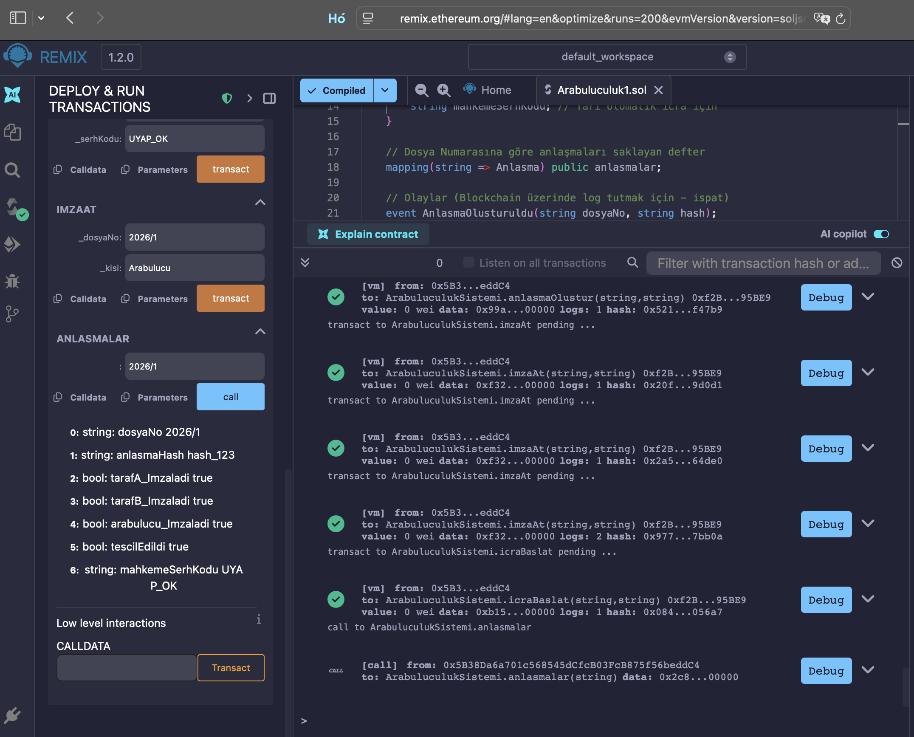
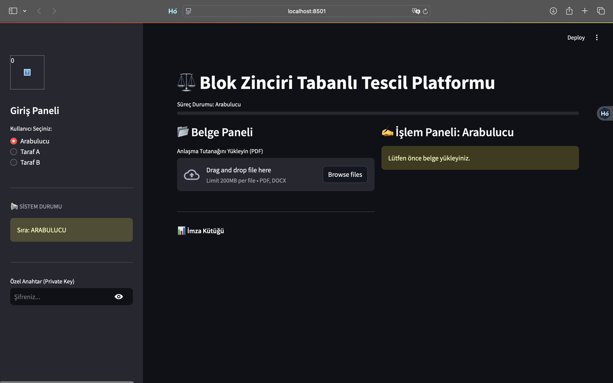

# blockchain-based-mediation-protocol
Türk Hukukunda arabuluculuk süreçleri için blok zinciri tabanlı tescil ve yarı-otomatik icra protokolü.
# ⚖️ Blok Zinciri Tabanlı Arabuluculuk Tutanaklarının Kriptografik Tescil Protokolü

   

## Proje Özeti
Bu proje, Türk Hukuku'ndaki arabuluculuk süreçlerinde karşılaşılan "ıslak imza zorunluluğu" ve "fiziksel tescil" problemlerini çözmek amacıyla geliştirilmiş hibrit bir **LegalTech** projesidir.

**Temel Amaç:** Avukatı olmayan vatandaşların uzaktan (online) katıldığı arabuluculuk süreçlerinde,  anlaşma tutanaklarının **Blok Zinciri (Blockchain)** üzerinde değiştirilemez ve inkâr edilemez (Non-repudiation) şekilde tescil edilmesini sağlamaktır.

---

## Çözülen Problem ve Yaklaşım

| Sorun Alanı | Mevcut Durum (Geleneksel) | Projenin Çözümü (Blockchain) |
| :--- | :--- | :--- |
| **İmza** | Arabuluculuk sürecinde taraflardan en az biri avukat ile temsil edilmediği ve e-imzaya sahip olmadığı takdirde ıslak imza atılması gerekmektedir. E-imza vatandaş için yaygın şekilde kullanımda olmadığı gibi belirli periyotlarla yenilenmesi gerekmekte ve külfet oluşturmaktadır. | **Kriptografik İmza:** Özel anahtar ile atılan dijital imza (5070 s. Kanun uyumlu) ile e-imza sahibi olmayan vatandaşların da fiziksel olarak imza atmasına gerek kalmadan güvenle tutanağı imzalamasına olanak sağlanmaktadır. |
| **Güven** | Tutanakların kaybolma riski. | **Değişmezlik (Immutability):** Belge Hash'inin blok zincirine kazınması. |
| **İcra** | Kanunda sayılan belli durumlarda arabuluculuk tutanağının ilam niteliği kazanabilmesi için icra edilebilirlik şerhi alınması gerekmektedir, bu süreç sulh hukuk mahkemesinde bir dava açılması ve sonuçlanmasını beklemeyi içerir ve bu süreç iş gücü ve bekleme süresi gerektirir. | **Yarı-Otomatik İcra:** Akıllı sözleşme ile resmi onayın (UYAP) otomatik işlenmesi ile usul ekonomisi adına kazanım sağlanır. |

---

##  Mimari: Hukuki-Teknik Eşleştirme

| Adım | Akıllı Sözleşme Fonksiyonu (Solidity) | Hukuki Karşılık (Legal Context) |
| :--- | :--- | :--- |
| **1** | `anlasmaOlustur(dosyaNo, hash)` | **Son Tutanağın Düzenlenmesi:** Arabulucu metni hazırlar, değişmezliği Hash ile sabitlenir. |
| **2** | `imzaAt(kisi)` | **İrade Beyanı:** Taraflar kriptografik anahtarlarıyla "Kabul Ediyorum" beyanını sunar. |
| **3** | `if (imzaSayisi == 3)` | **İlam Niteliği (HUAK Md. 18):** Taraflar ve arabulucunun (3 imza) tamamlanmasıyla belge mahkeme hükmü vasfını kazanır. |
| **4** | `event TescilTamamlandi` | **Resmi Sicil:** İşlem, dağıtık defterde zaman damgasıyla silinemez şekilde arşivlenir. |
| **5** | `icraBaslat(serhKodu)` | **Yarı-Otomatik İcra:** Taşınmaz devri gibi işlemlerde Mahkeme/UYAP onayı ile süreç tetiklenir. |

---
## 📂 Dosya Yapısı ve İçerik

Bu depo, projenin üç farklı katmanını temsil eden kodları barındırır:

* **`Arabuluculuk1.sol` (Blockchain/Smart Contract):** Ethereum ağında çalışacak olan Solidity tabanlı akıllı sözleşme kodu.
* **`arabuluculuk_blockchain.ipynb` (Backend/Logic):** Arayüzden bağımsız olarak, projenin arka planındaki kriptografik mantığı, hashleme ve imza süreçlerini saf Python kodu ile gösteren terminal simülasyonu.
* **`app.py` (Frontend/Arayüz):** Streamlit ile geliştirilmiş, son kullanıcının (Vatandaş/Arabulucu) deneyimleyebileceği web tabanlı simülasyon.

---

---
## ⚙️ Kurulum ve Test (3 Farklı Yöntem)

Projeyi test etmek için aşağıdaki yöntemlerden birini seçebilirsiniz:

### 1. Yöntem: Akıllı Sözleşme Testi (Remix IDE)
Projenin Solidity tabanlı blok zinciri mantığının (Backend) Ethereum Sanal Makinesi (EVM) üzerinde çalıştığını doğrulamak için:

1. **[Remix Ethereum](https://remix.ethereum.org/)** adresine gidin.
2. Repodaki `Arabuluculuk.sol` dosyasını sisteme yükleyin.
3. Sol menüden önce **"Compile"**, ardından **"Deploy"** butonlarına basın.
4. Açılan fonksiyonlar (`anlasmaOlustur`, `imzaAt`, `icraBaslat`) ile süreci manuel olarak test edin.

### Test Kanıtı (Proof of Concept)


---
### Yöntem 2: Konsol Simülasyonu (Saf Python)
Arayüz olmadan, sadece arka plandaki algoritma mantığını (Backend Logic) incelemek için:

Terminal veya Komut Satırına şu komutu yazın:
```bash
python Simulation.py
```
---

---
### 3. Yöntem: Arayüz Simülasyonu (Streamlit)
Vatandaş ve arabulucu gözünden kullanıcı deneyimini (UI/UX) ve iş akışını test etmek için:

**Adım 1: Repoyu İndirin**
```bash
git clone [https://github.com/sehersavas/blockchain-based-mediation-protocol.git](https://github.com/sehersavas/blockchain-based-mediation-protocol.git)
cd blockchain-based-mediation-protocol
```

**Adım 2: Gerekli Kütüphaneleri Yükleyin**
```
pip install -r requirements.txt
```
**Adım 3: Uygulamayı Başlatın**
```
streamlit run app.py
```
Komutu girdikten sonra tarayıcınızda otomatik olarak Dijital Arabuluculuk Proje Simülasyonu Platformu açılacaktır.

### 📂 Örnek Belge Çıktıları (Generated Artifacts)

Simülasyon sonucunda sistem tarafından otomatik üretilen resmi görünümlü, zaman damgalı ve QR kodlu tescil belgeleri:

1.  **İmzalanmış Arabuluculuk Tutanağı (Tescil) Belgesi (Şerhsiz - ÖRNEKTİR Damgalı)**
    * *Belge:* [Dijital_Tescil_Belgesi.html](Dijital_Tescil_Belgesi-5.html) (İndirilebilir)
    * *Açıklama:* Tarafların imzası tamamlandığında blok zinciri kaydını gösteren ilk belge.

2.  **İcra Şerhli Belge (MAHKEME ONAYLI)**
    * *Belge:* [Dijital_Tescil_Belgesi_Serhli.html](Dijital_Tescil_Belgesi-6.html) (İndirilebilir)
    * *Açıklama:* UYAP entegrasyonu sonrası mahkeme kararının ve doğrulama kodunun işlendiği nihai icra belgesi.


---

## Hukuki Dayanaklar
1. **6325 Sayılı Hukuk Uyuşmazlıklarında Arabuluculuk Kanunu (Md. 18):** İlam niteliğinde belge şartları.
2. **5070 Sayılı Elektronik İmza Kanunu (Md. 4):** Güvenli elektronik imzanın elle atılan imza ile eşdeğerliği.

---
## Metodoloji ve AI Kullanımı
Bu projenin hukuki mimarisi, iş akış şemaları ve çözüm modeli şahsıma aittir. 

Teknik prototipleme aşamasında (Solidity Akıllı Sözleşme kodlarının yazımı ve Python simülasyonu), kod verimliliğini artırmak ve hata ayıklamak amacıyla **Üretken Yapay Zeka (Generative AI)** araçlarından asistan desteği alınmıştır. Proje, insan denetimli (Human-in-the-loop) bir yaklaşımla geliştirilmiştir.

---
**Geliştirici:** Seher Savaş
*Avukat & Akdeniz Üniversitesi Veri Analitiği ve Yönetimi Yüksek Lisans Öğrencisi*
